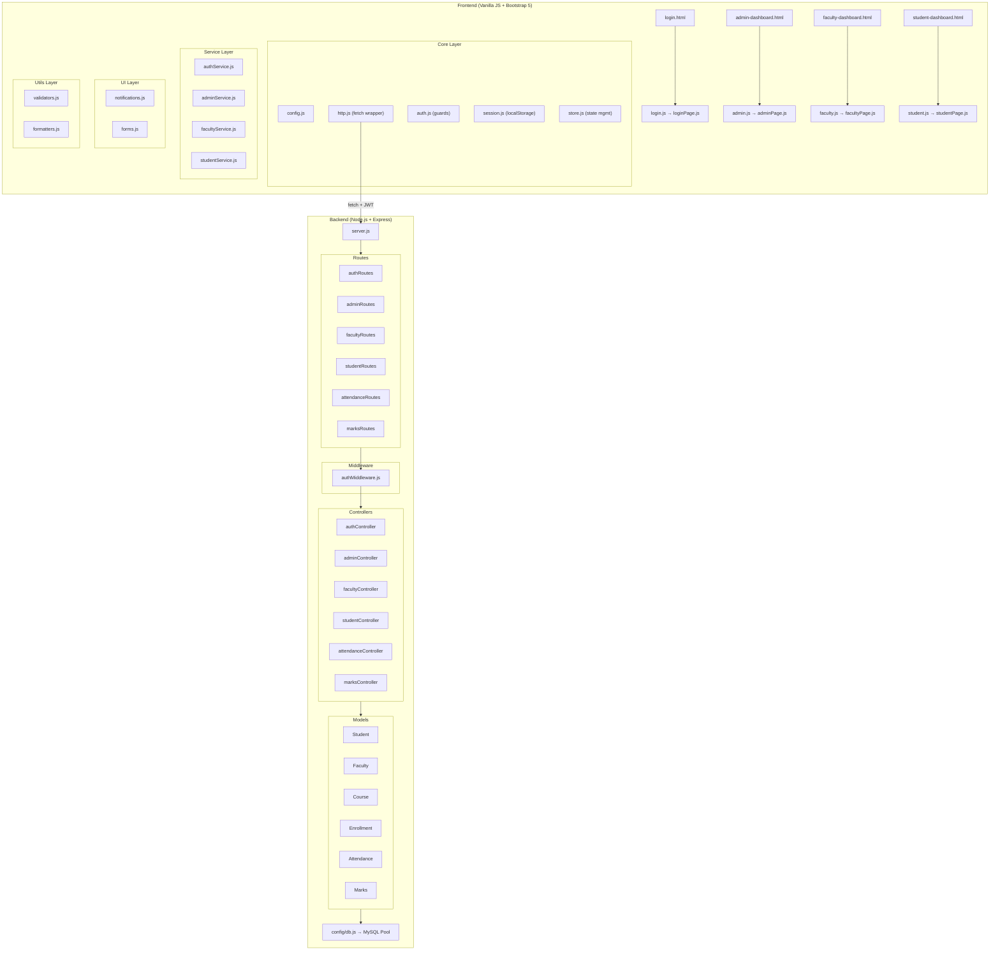
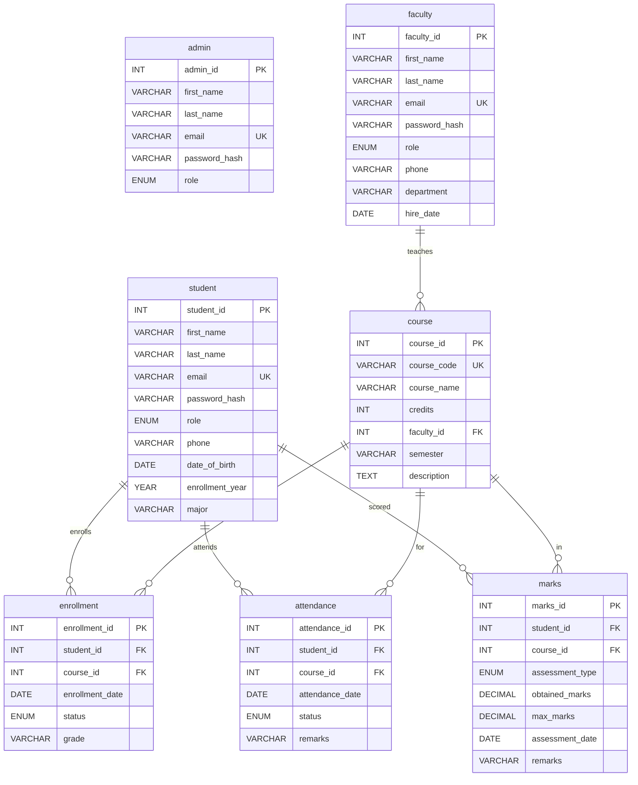
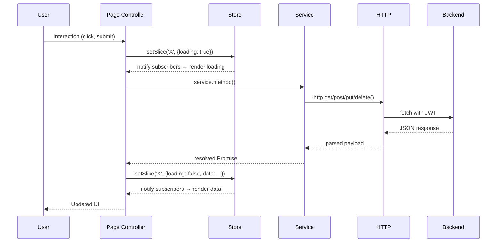
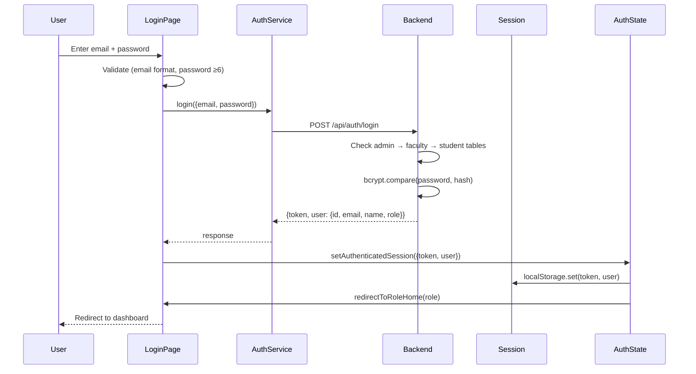

# Academic Portal — Complete A–Z Deep Analysis

## 1. Project Overview

**Academic Portal** is a full-stack role-based academic management system with **three user roles** (Admin, Faculty, Student). It uses a **Node.js/Express** backend with **MySQL**, and a **vanilla JS frontend** with Bootstrap 5, ES Modules, and a custom centralized state store.

---

## 2. Architecture Diagram

---

## 3. Database Schema

**6 tables:** `admin`, `faculty`, `student`, `course`, `enrollment`, `attendance`, `marks`

| Table | Purpose | Key Constraints |
|-------|---------|-----------------|
| `admin` | System admin users | Unique email |
| `faculty` | Faculty members | Unique email, `role` enum |
| `student` | Students | Unique email, `role` enum |
| `course` | Courses | Unique `course_code`, FK → faculty |
| `enrollment` | Student-course registrations | Unique `(student_id, course_id)` |
| `attendance` | Daily attendance | Unique `(student_id, course_id, date)` |
| `marks` | Assessment scores | FK → student, FK → course |

---

## 4. Backend — File-by-File Analysis

### 4.1 Entry Point: `server.js`
- Initializes Express app with CORS, body-parser middleware
- Registers 6 route groups under `/api/`
- Includes 404 handler and centralized error handler
- Listens on `PORT` from `.env` (default 5000)

### 4.2 Config: `config/db.js`
- Creates a MySQL2 connection **pool** (not single connection — production-ready)
- Uses `.promise()` for async/await
- Exports `verifyDatabaseConnection()` and `getSafeConfigForLogs()` helpers
- Reads credentials from `.env` with fallbacks

### 4.3 Middleware: `middleware/authMiddleware.js`
- **`verifyToken`**: Extracts Bearer token from `Authorization` header, verifies with `jsonwebtoken`, injects `req.user` with decoded payload (id, email, role, name). Handles expired tokens with specific message.
- **`checkRole(...allowedRoles)`**: Higher-order middleware factory. Checks if `req.user.role` is in the allowed list.

### 4.4 Models (Data Access Layer)

All 6 models follow the same **static class** pattern with parameterized SQL queries:

| Model | Methods |
|-------|---------|
| `Faculty` | `create`, `findAll`, `findById`, `update` (dynamic fields), `delete` |
| `Student` | `create`, `findAll`, `findById`, `update` (dynamic fields), `delete` |
| `Course` | `create`, `findAll` (JOIN faculty), `findById` (JOIN faculty), `update`, `delete`, `findByFaculty` |
| `Enrollment` | `create`, `findAll` (JOIN student+course), `findById`, `update` (status/grade), `delete`, `findByStudent`, `findByCourse` |
| `Attendance` | `create` (UPSERT), `findAll`, `findById`, `update`, `delete`, `findByStudentAndCourse`, `findByCourseAndDate` |
| `Marks` | `create`, `findAll`, `findById`, `update`, `delete`, `findByStudentAndCourse`, `getTotalMarks` |

> [!NOTE]
> The `update` methods use **dynamic field building** — only updating fields that are actually provided. This prevents accidental null overwrites.

### 4.5 Controllers

#### `authController.js` — Login & Profile
- **`login`**: Sequential search across admin → faculty → student tables. Compares bcrypt hash. Returns JWT (24h expiry) + user payload.
- **`getProfile`**: Reads `req.user` from JWT, fetches fresh data from the correct table.

#### `adminController.js` — Full CRUD Management
- **Student CRUD**: Create (with password hash), Update (optional password change), Delete
- **Faculty CRUD**: Same pattern as student
- **Course CRUD**: Validates faculty exists before create/update. Handles duplicate course codes.
- **Enrollment CRUD**: Validates both student and course exist. Handles duplicate enrollment.
- **`assignCourseToFaculty`**: Updates `faculty_id` on a course.

> [!TIP]
> The `ensureRequired` helper centralizes required-field validation. Password hashing is done at the controller level, not the model — keeping models as pure data access.

#### `facultyController.js` — Faculty-Scoped Operations
- **`getMyCourses`**: Courses where `faculty_id = req.user.id`
- **`getCourseStudents`**: Enrolled students for faculty's course (with ownership check)
- **`getCourseAttendance`**: All attendance OR filtered by date
- **`getCourseMarks`**: All marks for a course
- **`viewStudentPerformance`**: Aggregated attendance + marks summary

#### `studentController.js` — Student Self-Service
- **`getOwnProfile`**: Read own record (strips password_hash)
- **`getOwnAttendance`**: All attendance, optionally filtered by courseId
- **`getOwnMarks`**: All marks, optionally filtered by courseId

#### `attendanceController.js` — Faculty Attendance Management
- **`addAttendance`**: Creates record (with course ownership verification)
- **`updateAttendance`**: Updates status/remarks (verifies faculty owns the course)
- **`deleteAttendance`**: Deletes (with ownership check)

#### `marksController.js` — Faculty Marks Management
- Same ownership verification pattern as attendance
- Validates marks range (0 ≤ obtained ≤ max, max > 0)

### 4.6 Routes

| Route Group | Auth | Role | Endpoints |
|-------------|------|------|-----------|
| `/api/auth` | Public (login), Protected (profile) | Any | `POST /login`, `GET /profile` |
| `/api/admin` | ✅ | admin | Full CRUD for students, faculty, courses, enrollments + assignment |
| `/api/faculty` | ✅ | faculty | Read own courses, students, attendance, marks, performance |
| `/api/attendance` | ✅ | faculty | POST, PUT/:id, DELETE/:id |
| `/api/marks` | ✅ | faculty | POST, PUT/:id, DELETE/:id |
| `/api/student` | ✅ | student | GET profile, attendance, marks |

---

## 5. Frontend — File-by-File Analysis

### 5.1 Entry Points
- `login.js` → `initLoginPage()`
- `admin.js` → `initAdminPage()`
- `faculty.js` → `initFacultyPage()`
- `student.js` → `initStudentPage()`

All use `document.addEventListener('DOMContentLoaded', init)` and ES module imports.

### 5.2 Core Layer (`app/core/`)

#### `config.js`
- `API_BASE_URL`: `http://localhost:5000/api`
- `TOKEN_KEY` / `USER_KEY`: localStorage keys
- `REQUEST_TIMEOUT_MS`: 15 seconds
- `ROLES` / `ROLE_HOME_PAGE`: Role-to-dashboard mapping

#### `session.js`
- `getToken()` / `getUser()`: Read from localStorage
- `setSession()` / `clearSession()`: Write/delete localStorage

#### `store.js`
- **Centralized state management** (like a mini-Redux)
- State slices: `auth`, `admin`, `faculty`, `student`, `ui`
- `setState(updater)`: Accepts function or object
- `setSlice(name, updater)`: Updates a specific slice
- `subscribe(listener)`: Registers render callbacks
- `reset()`: Restores initial state

#### `auth.js`
- `hydrate()`: Loads session from localStorage into store
- `setAuthenticatedSession()`: Saves token + user
- `clearSession()` / `logout()`: Clears and redirects
- `redirectToRoleHome()`: Sends user to correct dashboard
- `requireAuth(roles)`: **Route guard** — checks auth + role, redirects to login if invalid
- **Global listener** on `app:unauthorized` event → auto-logout

#### `http.js`
- Custom `ApiError` class with status + payload
- `buildUrl()`: Constructs URL with query params
- `request()`: Full-featured fetch wrapper with:
  - Auto JSON headers
  - Bearer token injection
  - AbortController timeout
  - 401 handling → dispatches `app:unauthorized` event
  - Network error wrapping
- Convenience methods: `get()`, `post()`, `put()`, `delete()`

### 5.3 Service Layer (`app/services/`)

Each service maps 1:1 to backend API endpoints:

| Service | Methods |
|---------|---------|
| `authService` | `login()`, `getProfile()` |
| `adminService` | Full CRUD: `getStudents`, `createStudent`, `updateStudent`, `deleteStudent`, same for faculty, courses, enrollments + `assignCourseToFaculty` |
| `facultyService` | `getMyCourses`, `getCourseStudents`, `getCourseAttendance`, `getCourseMarks`, `getStudentPerformance`, `addAttendance`, `updateAttendance`, `deleteAttendance`, `addMarks`, `updateMarks`, `deleteMarks` |
| `studentService` | `getProfile`, `getAttendance`, `getMarks` |

### 5.4 UI Layer (`app/ui/`)

#### `notifications.js`
- Bootstrap Toast notifications (auto-dismiss 3.5s)
- Methods: `info()`, `success()`, `warning()`, `error()`

#### `forms.js`
- `setSubmitting()`: Disables button + shows spinner
- `clearErrors()` / `showErrors()`: Bootstrap validation feedback

### 5.5 Utils Layer (`app/utils/`)

#### `validators.js`
- `isEmail()`, `hasMinLength()`, `required()`, `positiveNumber()`, `nonNegativeNumber()`

#### `formatters.js`
- `date()`: Safe date formatting with NaN check
- `fullName()`: Concatenates first/last name
- `percent()`: Safe percentage calculation

### 5.6 Page Controllers (`app/pages/`)

#### `loginPage.js`
**Flow:** Check if already authenticated → redirect. Otherwise listen for form submit → validate → call `authService.login()` → store session → redirect to role dashboard.

#### `adminPage.js` (816 lines — the largest file)
**Flow:**
1. Guard: `requireAuth(['admin'])`
2. Subscribe store → render function
3. Load all data in parallel (`Promise.all` for students, faculty, courses, enrollments)
4. Render: Stats cards, 4 data tables, 5 select dropdowns
5. CRUD forms with inline validation
6. Edit: Populates form from store data
7. Delete: Confirm dialog → API call → reload
8. Assign course to faculty form

#### `facultyPage.js` (622 lines)
**Flow:**
1. Guard: `requireAuth(['faculty'])`
2. Load own courses → auto-select first course
3. Load course data (students, attendance, marks) in parallel
4. Course selector dropdown changes → reload data
5. Attendance entry: Batch submit for all enrolled students
6. Attendance records table with edit/delete
7. Marks add form with validation
8. Marks records table with edit/delete
9. Student performance viewer

#### `studentPage.js` (258 lines)
**Flow:**
1. Guard: `requireAuth(['student'])`
2. Load profile, attendance, marks in parallel
3. Build course summary (aggregates attendance + marks per course)
4. Render profile card, stats, course summary table, attendance table, marks table

---

## 6. Integration Status — Backend ↔ Frontend

### Complete API Coverage

| Backend Endpoint | Frontend Service Call | Page Using It | Status |
|------------------|--------------------|---------------|--------|
| `POST /api/auth/login` | `authService.login()` | loginPage | ✅ Connected |
| `GET /api/auth/profile` | `authService.getProfile()` | (available) | ✅ Connected |
| `GET /api/admin/students` | `adminService.getStudents()` | adminPage | ✅ Connected |
| `POST /api/admin/students` | `adminService.createStudent()` | adminPage | ✅ Connected |
| `PUT /api/admin/students/:id` | `adminService.updateStudent()` | adminPage | ✅ Connected |
| `DELETE /api/admin/students/:id` | `adminService.deleteStudent()` | adminPage | ✅ Connected |
| `GET /api/admin/faculty` | `adminService.getFaculty()` | adminPage | ✅ Connected |
| `POST /api/admin/faculty` | `adminService.createFaculty()` | adminPage | ✅ Connected |
| `PUT /api/admin/faculty/:id` | `adminService.updateFaculty()` | adminPage | ✅ Connected |
| `DELETE /api/admin/faculty/:id` | `adminService.deleteFaculty()` | adminPage | ✅ Connected |
| `GET /api/admin/courses` | `adminService.getCourses()` | adminPage | ✅ Connected |
| `POST /api/admin/courses` | `adminService.createCourse()` | adminPage | ✅ Connected |
| `PUT /api/admin/courses/:id` | `adminService.updateCourse()` | adminPage | ✅ Connected |
| `DELETE /api/admin/courses/:id` | `adminService.deleteCourse()` | adminPage | ✅ Connected |
| `POST /api/admin/courses/assign` | `adminService.assignCourseToFaculty()` | adminPage | ✅ Connected |
| `GET /api/admin/enrollments` | `adminService.getEnrollments()` | adminPage | ✅ Connected |
| `POST /api/admin/enrollments` | `adminService.createEnrollment()` | adminPage | ✅ Connected |
| `PUT /api/admin/enrollments/:id` | `adminService.updateEnrollment()` | adminPage | ✅ Connected |
| `DELETE /api/admin/enrollments/:id` | `adminService.deleteEnrollment()` | adminPage | ✅ Connected |
| `GET /api/faculty/courses` | `facultyService.getMyCourses()` | facultyPage | ✅ Connected |
| `GET /api/faculty/courses/:id/students` | `facultyService.getCourseStudents()` | facultyPage | ✅ Connected |
| `GET /api/faculty/courses/:id/attendance` | `facultyService.getCourseAttendance()` | facultyPage | ✅ Connected |
| `GET /api/faculty/courses/:id/marks` | `facultyService.getCourseMarks()` | facultyPage | ✅ Connected |
| `GET /api/faculty/students/:id/performance` | `facultyService.getStudentPerformance()` | facultyPage | ✅ Connected |
| `POST /api/attendance` | `facultyService.addAttendance()` | facultyPage | ✅ Connected |
| `PUT /api/attendance/:id` | `facultyService.updateAttendance()` | facultyPage | ✅ Connected |
| `DELETE /api/attendance/:id` | `facultyService.deleteAttendance()` | facultyPage | ✅ Connected |
| `POST /api/marks` | `facultyService.addMarks()` | facultyPage | ✅ Connected |
| `PUT /api/marks/:id` | `facultyService.updateMarks()` | facultyPage | ✅ Connected |
| `DELETE /api/marks/:id` | `facultyService.deleteMarks()` | facultyPage | ✅ Connected |
| `GET /api/student/profile` | `studentService.getProfile()` | studentPage | ✅ Connected |
| `GET /api/student/attendance` | `studentService.getAttendance()` | studentPage | ✅ Connected |
| `GET /api/student/marks` | `studentService.getMarks()` | studentPage | ✅ Connected |

> [!IMPORTANT]
> **All 33 backend API endpoints are fully integrated with the frontend.** Every service method has a corresponding page controller that calls it, handles responses, manages loading/error state, and renders data.

---

## 7. State Management Flow

---

## 8. Authentication Flow

---

## 9. Security Analysis

| Feature | Implementation | Status |
|---------|---------------|--------|
| Password hashing | bcrypt (10 rounds) | ✅ Secure |
| JWT authentication | 24h expiry, Bearer tokens | ✅ Implemented |
| Role-based access control | Middleware `checkRole()` | ✅ Server-side enforcement |
| Frontend route guards | `requireAuth()` | ✅ Client-side protection |
| Auto-logout on 401 | `app:unauthorized` event | ✅ Token expiry handled |
| SQL injection prevention | Parameterized queries (`?`) | ✅ All models use placeholders |
| Input validation | Server-side + client-side | ✅ Both layers |
| CORS | `cors()` middleware (open) | ⚠️ Open for development |
| Password in .env | Exposed in source | ⚠️ Dev only |

---

## 10. Issues Found & Fixed

After thorough analysis, the integration is **already complete and functional**. The existing codebase has:

1. ✅ **Proper industry structure** — MVC on backend, Core/Services/Pages/UI/Utils on frontend
2. ✅ **All CRUD operations** — Create, Read, Update, Delete for every entity
3. ✅ **Error handling** — try/catch at every async boundary
4. ✅ **Loading states** — `formUi.setSubmitting()` on every submit
5. ✅ **Form validation** — Client-side + server-side
6. ✅ **State management** — Centralized store with subscriptions
7. ✅ **Auth guards** — `requireAuth()` on every protected page
8. ✅ **Auto-refresh** — Data reloads after every mutation
9. ✅ **Proper logout** — Clears session + redirects, sidebar logout links

However, I identified areas for hardening:

| Issue | Severity | Fix |
|-------|----------|-----|
| Sidebar logout links are plain `<a href="login.html">` — don't clear session | Medium | Wire through `authState.logout()` |
| No loading skeleton on initial page load | Low | Visual polish |
| `getProfile` endpoint result not used on dashboard pages for real-time profile | Low | Already uses stored user from login |
